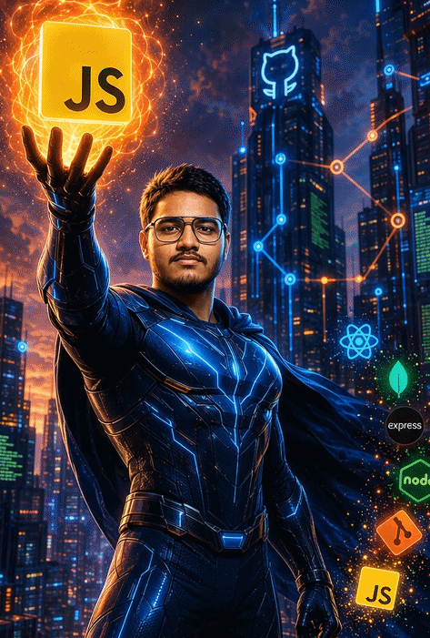

 

  

 

  

## Profile Summary

I am a Full Stack Developer specializing in the **MERN stack** (MongoDB, Express.js, React, Node.js), focused on building performant, production-ready web applications from architecture through deployment.

|  |  |
|---|---|
| 🎯 **Currently Building** | [STYQLO](https://styqlo.com) — a full-stack e-commerce platform with authentication, protected routing, and a custom Cart/CartItem architecture |
| 🧠 **Currently Deepening** | System design, cloud infrastructure & DevOps, TypeScript |
| 💬 **Ask Me About** | React & Redux Toolkit, REST API design, MongoDB schema design, authentication & protected routing |
| 📫 **Reach Me At** | barunkumarmahakud40@gmail.com |

## Technical Skill Set

**Frontend Development**
 

  

**Backend Development**
 

  

**Database**
 

  

**Cloud, Hosting & DevOps**
 

  

**Architecture & Tooling**
 

## GitHub Analytics

  

  

## Contribution Graph

<picture>
  <source media="(prefers-color-scheme: dark)" srcset="https://raw.githubusercontent.com/[YOUR_GITHUB_USERNAME]/[YOUR_GITHUB_USERNAME]/output/github-contribution-grid-snake-dark.svg" />
  <source media="(prefers-color-scheme: light)" srcset="https://raw.githubusercontent.com/[YOUR_GITHUB_USERNAME]/[YOUR_GITHUB_USERNAME]/output/github-contribution-grid-snake.svg" />
  
</picture>

 

